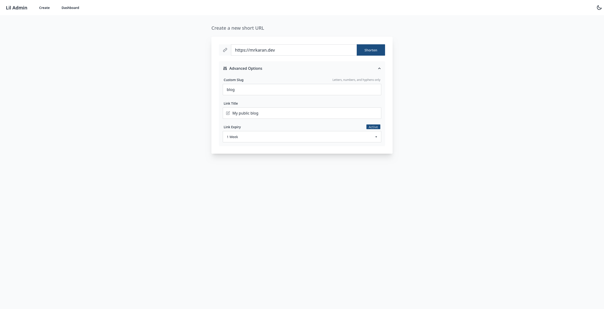
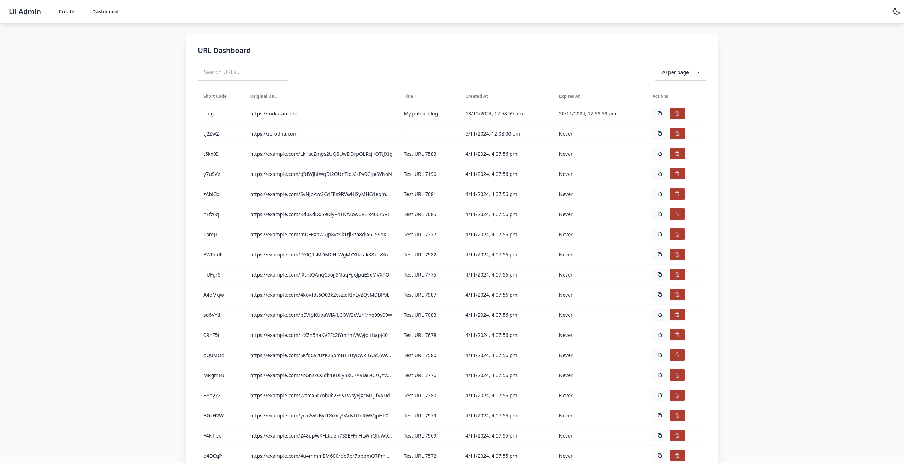
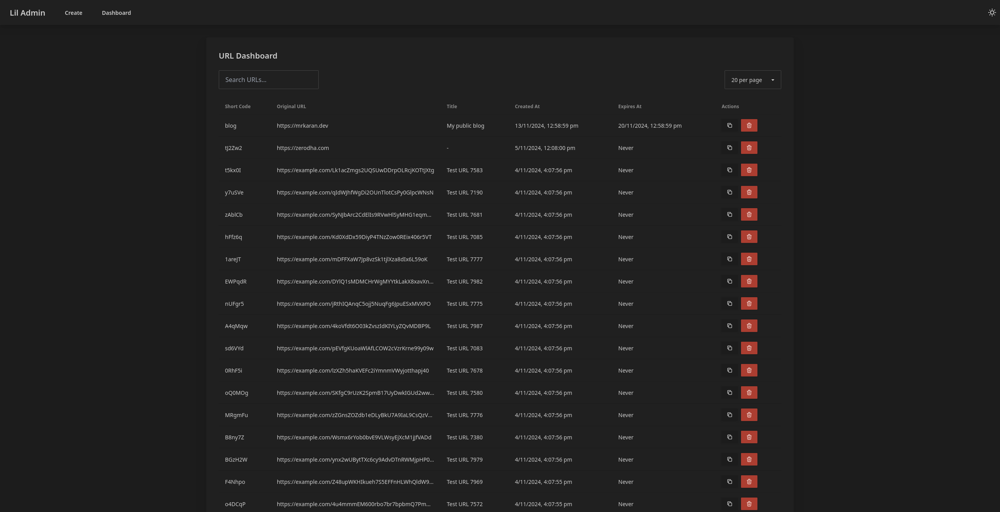

# Lil - High performant URL Shortener

Lil is a high-performance URL shortener built in Go, designed with scalability and extensibility in mind. It combines the simplicity of SQLite with the power of in-memory caching to deliver lightning-fast URL redirects while providing rich analytics capabilities.

## Key Features

- **Fast**: Uses in-memory cache alongside SQLite for high performance
- **Flexible Analytics**: Supports multiple analytics providers out of the box
  - Plausible Analytics integration
  - Access log provider for analysis with tools like GoAccess
  - Custom webhook support for easy integration with other services
- **Admin UI**: Clean, responsive dashboard built with Vue.js
- **Monitoring**: Built-in Prometheus metrics for observability
- **URL Management**:
  - Custom slugs support
  - URL expiration
  - Title and metadata storage
  - Pagination and search in admin UI

## Architecture Overview

- **Storage**: SQLite for persistence + In-memory cache for performance
- **Async Analytics**: Background workers handle analytics dispatch without impacting redirect performance
- **Extensible**: Easy to add new analytics providers through a simple interface
- **API**: RESTful JSON API for programmatic access
- **Metrics**: Prometheus metrics for monitoring redirects, cache size, etc.

---


*Create URL*


*Dashboard*


*Dark Mode*

---

## Getting Started

### Using Docker

The easiest way to run Lil is using Docker:

```bash
docker run -p 7000:7000 \
  -v $(pwd)/config.toml:/app/config.toml \
  -v $(pwd)/urls.db:/app/urls.db \
  ghcr.io/mr-karan/lil:latest
```

### Using Docker Compose

A complete example with persistent storage:

```bash
docker compose up -d
```

See `docker-compose.yml` for a production-ready setup.

### Manual Installation

1. Download the latest release
2. Configure via `config.toml`
3. Run the binary
4. Access admin UI at `/admin`

## Configuration

See `config.toml` for all available options. Key sections:

```toml
[server]
address = ":7000"

[db]
path = "urls.db"

[analytics]
enabled = true
num_workers = 2

[analytics.providers.plausible]
endpoint = "http://plausible:8000/api/event"
```

## API Documentation

See `docs/api.md` for detailed API documentation.

## Domain Setup

Lil supports running on separate domains for public URL shortening and admin interface:

### Configuration

1. Set your public domain in `config.toml`:
```toml
[app]
public_url = "https://lil.io"  # Base URL for shortened URLs
```

### Architecture

The application can be deployed with two separate domains. For eg the following config can be referred for production deployments:

### Nginx Configuration Example

```ini
# Public URL shortener
server {
    listen 80;
    server_name lil.io;

    # Block access to admin interface
    location /admin {
        return 403;
    }

    # Forward everything else to the application
    location / {
        proxy_pass http://localhost:7000;
        proxy_set_header Host $host;
        proxy_set_header X-Real-IP $remote_addr;
    }
}

# Admin interface
server {
    listen 80;
    server_name liladmin.internal;

    # Only allow internal network access
    allow 10.0.0.0/8;
    allow 172.16.0.0/12;
    allow 192.168.0.0/16;
    deny all;

    location / {
        proxy_pass http://localhost:7000;
        proxy_set_header Host $host;
        proxy_set_header X-Real-IP $remote_addr;
    }
}
```

## License

[LICENSE]

## Contributing

Contributions welcome! Please read our contributing guidelines before submitting PRs.
